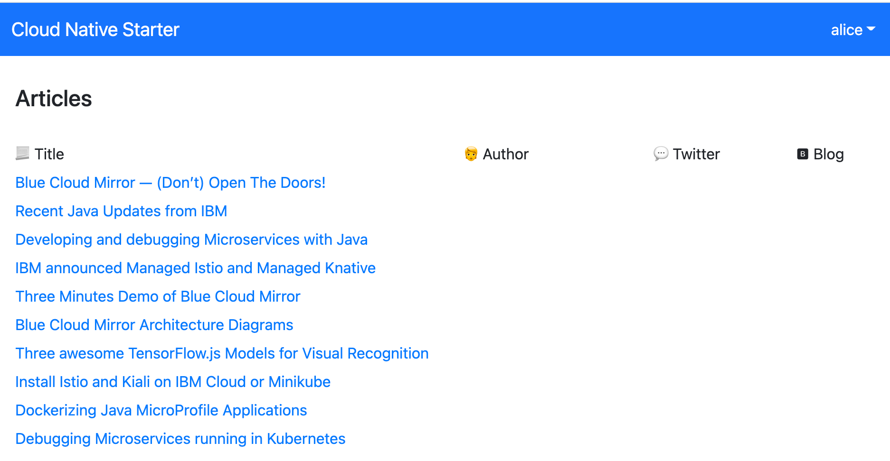

# [Jumpstart: Deploy a Java Microservices Application to `Code Engine`](https://ibm.github.io/ce-cns)

Please follow this **[link](https://ibm.github.io/ce-cns) to access the full workshop documentation**:

and here is the link to the documentation on [IBM Developer](https://developer.ibm.com/tutorials/deploy-a-java-microservices-application-to-ibm-cloud-code-engine/#labs).

> FYI: The workshop documententation uses [GitHub Pages](https://pages.github.com/) with [MkDocs](https://www.mkdocs.org/please). For more details please visit "[How to setup MkDocs?](https://suedbroecker.net/2021/01/25/how-to-install-mkdocs-on-mac-and-setup-the-integration-to-github-pages/)".

## Brief architecture overview

This `workshop` is related to the [Cloud Native Starter](https://github.com/ibm/cloud-native-starter) project. In the workshop we use a customized version of the [security application example](https://developer.ibm.com/languages/java/tutorials/secure-your-java-microservices-application-workshop/). The example application simply shows articles protected with an `Identity and Access Manegement`. In the following picture you see the frontend with the articles and the valid user `alice` is logged on.

The following diagram shows the architecture of the example application. There is a `web-app` frontend application that serves the JavaScript/Vue.js code to the browser. The `web-app` code running in the browser invokes a REST API of the `web-api` microservice. The `web-api` microservice in turn invokes a REST API of the `articles` microservice. [`Keycloak`](https://www.keycloak.org/) is used for the `Identity and Access Management` of that microservices based application. To see the results in the web application, users need to be authenticated and they need to have the role `user`.

The image below shows the dependencies of the example:

