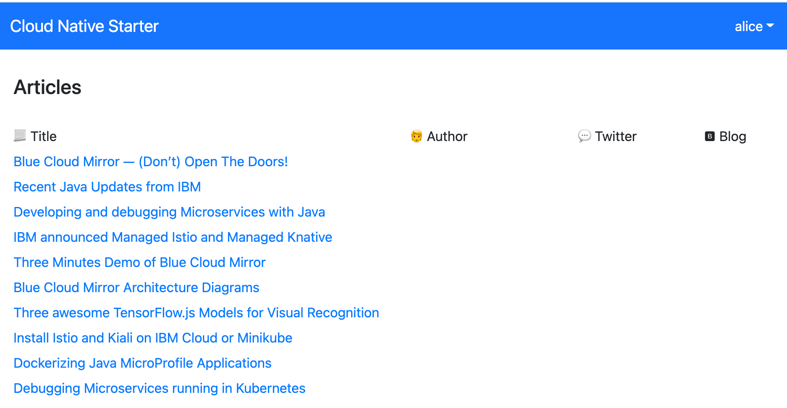
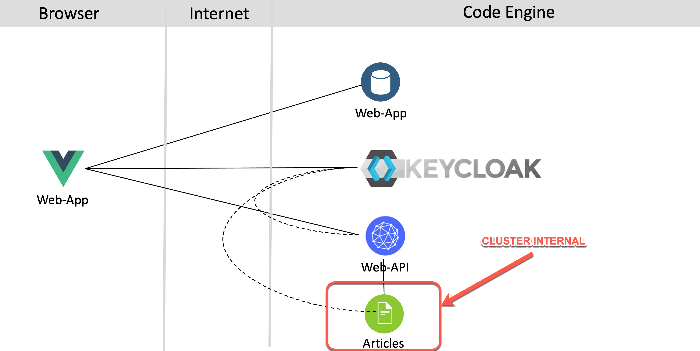

# Workshop: Get started to deploy a Java Microservices application to `Code Engine`

### Objectives

The workshop addresses the topic containerized applications on `IBM Cloud Code Engine`.

After you complete this workshop, you'll have a basic understanding of the following:

  * Deploy an existing Java microservices `containerized` application example to `Code Engine`
      * See the usage of the `IBM Cloud Code Engine CLI`
  * Understand internal and external `HTTP/HTTPS routing` between the microservices
  * Use the `Out-Of-The-Box` monitoring for the example application
  * Use the `Out-Of-The-Box` logging for the example application

> _The scope of this workshop is not to explain every aspect of running an application or job on `Code Engine`. It's just about containerized applications._

Here is a `1 hour` YouTube `live stream` on [IBM Developer](https://www.youtube.com/channel/UCUm6InQvGI9-6vo1teGWINA)

### Prerequisites

* In order to run this workshop, you will need to create an [IBM Cloud `PayAsYouGo` account](https://ibm.biz/BdfXAn) (or log in to your existing account).

  > `Code Engine` has a `free tier` per month, and we expect, if you haven't used that `free tier` in current month, you can execute the workshop without creating any additional costs. For the monitoring and logging we will use free lite plans for the service instances [IBM Cloud Monitoring](https://cloud.ibm.com/docs/monitoring?topic=monitoring-getting-started#getting-started) and 
 [IBM Cloud Log Analysis](https://cloud.ibm.com/docs/log-analysis?topic=log-analysis-getting-started#getting-started).

* You should have a basic understanding of containerized applications

### Estimated time and level

  |  Time | Level  |
  | - | - |
  | 1 h | beginners |

### Architecture

> This `workshop` is related to the [Cloud Native Starter](https://github.com/ibm/cloud-native-starter) project. In the workshop we use a costomized version of the [security application example](https://developer.ibm.com/languages/java/tutorials/secure-your-java-microservices-application-workshop/). 

The example application simply shows articles protected with an `Identity and Access Manegement`.
In the following picture you see the frontend with the articles and the valid user `alice` is logged on.

The following diagram shows the architecture of the example application. There is a `web-app` frontend application that serves the Javascript/Vue.js code to the browser. The `web-app` code running in the browser invokes a REST API of the `web-api` microservice. The `web-api` microservice in turn invokes a REST API of the `articles` microservice. [`Keycloak`](https://www.keycloak.org/) is used for the `Identity and Access Manegement` of that microservices based application. To see the results in the web application, users need to be authenticated and they need to have the role `user`.

The image below shows the dependencies of the example:

* External and internal routing

In our context it's useful to have a basic understanding of the routing for example application. Based on the functionality of the application, we need `three external routes` for the example application.

Each external route communication will be automaticly secured with a [TLS Encryption](https://en.wikipedia.org/wiki/Transport_Layer_Security) created by `Code Engine` using [Let's encrypt](https://letsencrypt.org/). The three applications are the `web-app` which will be loaded into the browser, the `Keycloak` that must be available for the authentication/authorization to our application and for potential configruation the `Identity and Access Manegement` and finally the `web-api` microservice which provides the articles data and will be invoked be the `web-app`.

The `articles` microservice doesn't need to be invoked from external, so it's configured to provide only an `internal route`, which is used by the  `web-api` microservice to get the articles from.

* Basics about the deployment

For an easy deployment prebuild containers were created and pushed to a [Quay container registry](https://quay.io/user/tsuedbroecker).
In the following table you see the **application**/container, the exposed **routes**, uses of **TLS Encryption**, the **scale to zero** configuration, the **container registry** where the prebuild container comes from, the configuration for **vCPU** and **Memory in GB** and the **min/max Instances** for the applications.

| **Application** | **Route** | **TLS Encryption** | **Scale to zero** | **Container Registry** | **vCPU** | **Memory** | **min Instances** | **max Instances** |
| --- | --- | --- | --- |  --- | --- |  --- | --- | --- |
| web-app | external | yes |yes | Quey | 0.5 | 1 GB | 0 | 1 |
| **keycloak** | external | yes | **no** | Docker | 0.5 | 1 GB | 1 | 1 |
| web-api  | external | yes | yes | Quey | 0.5 | 1 GB | 0 | 1 |
| **articles** | **internal** | no (mTLS comming sone) | yes | Quey | 0.25 | 0.5G GB | 0 | 1 |

The `Keycloak` application for the `Identity and Access Manegement` isn't configured to `scale to zero`, because the application is `stateful` and contains the realm configuration, which will be delete, if you would restart the application.

_Note:_ The project also contains the source code, that you can use to customize to your an own version of the microservices based example application.

### About this workshop

<!-- The introductory page of the workshop is broken down into the following sections:

* [Agenda](#agenda)
* [Compatibility](#compatibility)
* [Technology Used](#technology-used)
* [Credits](#credits)
* [What`s next?](#whats-next?) -->

### Agenda

These are the sections of this workshop, go through all of them in sequence, start with `Lab 1. Setup the example application` :

 1. [Setup the example application](./setup-example.md)
 2. [Inspect the `Code Engine` project](./inspect-the-project.md)
 3. [Monitoring of the applications](./monitoring.md)
 4. [Logging of the applications](./logging.md)
 5. [Cleanup the example application](./cleanup-example.md)

Optional Labs: 
 
 1. [Run the example application locally](./run-application-locally.md)
 2. [Push the example containers to a container registry](./push-to-container-registry.md)

### Compatibility

The workshop uses following IBM Cloud Services:

 * [IBM Cloud Code Engine](https://cloud.ibm.com/docs/codeengine?topic=codeengine-about)
 * [IBM Cloud Monitoring](https://cloud.ibm.com/docs/monitoring?topic=monitoring-getting-started#getting-started) (lite plan)
 * [IBM Cloud Log Analysis](https://cloud.ibm.com/docs/log-analysis?topic=log-analysis-getting-started#getting-started) (lite plan)

`IBM Cloud Code Engine` is build on [Open Source](https://en.wikipedia.org/wiki/Open_source) technologies:

  * [Knative](https://knative.dev/)
  * [Kubernetes](https://knative.dev/)
  * [Istio](https://istio.io/)
  * [Tekton](https://tekton.dev/)
        
### Technology Used

The example mircorservices application example is build with following `technologies/tools/frameworks`.

  * [Microservices architecture](https://en.wikipedia.org/wiki/Microservices)
  * [Keycloak](https://www.keycloak.org)
  * [Jakarta EE](https://jakarta.ee/)
  * [MicroProfile](https://microprofile.io/)
  * [Quarkus](https://quarkus.io/ingress)
  * [Vue.js](https://vuejs.org/)
  * [NGINX](https://www.nginx.com/)
  * [git 2.24.1 or higher](https://git-scm.com/book/en/v2/Getting-Started-Installing-Git)
  * [yarn 1.22.4 or higher](https://yarnpkg.com)
  * [Node.js v14.6.0 or higher](https://nodejs.org/en/)
  * [Apache Maven 3.6.3](https://maven.apache.org/ref/3.6.3/maven-embedder/cli.html)

### Credits

  * [Thomas Südbröcker](https://twitter.com/tsuedbroecker)
  * [Niklas Heidloff](https://twitter.com/nheidloff) (Feedback and Cloud Native Starter project)
  * [Simon Moser](https://twitter.com/mosersd) (Feedback)
  * [Doug Davis](https://twitter.com/duginabox) (Feedback)

### Additional resources

  * IBM CLoud Code Engine:

       * [Examples on GitHub](https://github.com/IBM/CodeEngine)
       * [Code Engine CLI reference](https://cloud.ibm.com/docs/codeengine?topic=codeengine-cli)

  * Cloud Native Starter example source code:

       * [Cloud-Native-Starter project](https://github.com/IBM/cloud-native-starter)
       * [Cloud-Native-Starter project security](https://github.com/IBM/cloud-native-starter/security)

  * Keycloak

       * [Keycloak core concepts of open-source identity and access management](https://developers.redhat.com/blog/2019/12/11/keycloak-core-concepts-of-open-source-identity-and-access-management/)
       * [Setting up Keycloak in OpenShift](http://heidloff.net/article/setting-up-keycloak-openshift/)
       * [Security in Quarkus Applications via Keycloak](http://heidloff.net/article/security-quarkus-applications-keycloak/)
       * [Securing Vue.js Applications with Keycloak](http://heidloff.net/article/securing-vue-js-applications-keycloak/)
       * [Simply logout from Keycloak](https://suedbroecker.net/2021/05/18/simply-logout-from-keycloak/)
       * [How to create a new realm with the Keycloak REST API](https://suedbroecker.net/2020/08/04/how-to-create-a-new-realm-with-the-keycloak-rest-api/)
       
  * Quarkus

       * [How to use environment variables to make a containerized Quarkus application more flexible](https://suedbroecker.net/2021/05/31/how-to-use-environment-variables-to-make-a-containerized-quarkus-application-more-flexible/)
       * [Configure the attach debug for Quarkus in Visual Studio Code](https://suedbroecker.net/2021/04/29/configure-the-attach-debug-for-quarkus-in-visual-studio-code/)

  * Vue.js
  
       * [Use environment variables to make a containerized Vue.js frontend application more flexible and deploy it to Code Engine](https://suedbroecker.net/2021/06/07/use-environment-variables-to-make-a-containerized-vue-js-frontend-application-more-flexible-and-deploy-it-to-code-engine/)
       * [How to debug the Javascript code of a Vue.js application using Visual Studio Code](https://suedbroecker.net/2021/05/17/how-to-debug-a-javascript-code-of-a-vue-js-application-using-visual-studio-code/)

