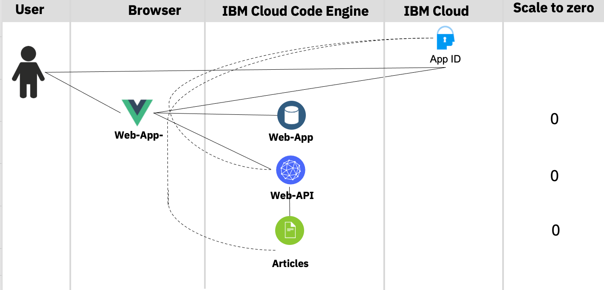

# Optional Lab 3: Run the example application with App ID

In this optional lab we use for authentication and authorization an [IBM Cloud App ID](https://www.ibm.com/cloud/app-id) service instance.

We will create an [IBM Cloud App ID](https://www.ibm.com/cloud/app-id) service instance using a **"lite"** plan, this plan type does not create additional costs for us.

> Currently this lab is not documented very detailed. **It's designed to be a part of a live session.**

### Architecture

Here is a simplified architecture diagram which shows the **Web-App** and the two microservices **Web-API** and **Articles** and **App ID** are running on IBM Cloud.

* Code Engine applications
    * **Web-App**
    * **Web-API** 
    * **Articles**

* IBM Cloud services
    * **App ID**



### Deploy the example application with App ID

#### (optional) Step 1 : Clone the GitHub project to the **`IBM Cloud Shell`**

> Only needed, if you haven't done it before.

Insert these commands to clone the GitHub project to the `IBM Cloud Shell`.

```sh
git clone https://github.com/ibm/ce-cns.git
cd ce-cns
ROOT_FOLDER=$(pwd)
```

#### (optional) Step 2: Now set the environment variable for later usage

> Only needed, if you haven't done it before.

> REMEMBER! Your Code Engine project name `cloud-native-starter-[YOUR-EXTENTION]`

```sh
export MYPROJECT=cloud-native-starter-[YOUR-EXTENTION]
```

#### Step 3: Execute following bash automation

> Be patient, because the script may take several minutes (_up to 10 min_).

```sh
cd $ROOT_FOLDER/CE
bash appid-ce-deploy-apps.sh
```

#### Step 4: Simplified steps of the bash script

Here are the simplified steps that are carried out in the bash script using mainly the IBM Cloud `Code Engine CLI`:

1. Connect to the `Code Engine project` with the  [Code Engine CLI](https://cloud.ibm.com/docs/codeengine?topic=codeengine-cli) and get the **namespace** for later usage to define the internal route.
2. Create an `App ID` instance
3. Configure the `App ID` instance
4. Deploy `articles` microservice which is defined as `local cluster` here, we need to know the `namespace`. ([details are related to Knative](https://github.com/knative/serving/issues/7450))
5. Deploy `web-api` with the needed `App ID` and `articles` urls as environment variables.
6. Deploy `web-app` with the needed `App ID` and `web-api` urls as environment variables.

#### Step 5: Inspect the output

The relevant urls will be listed.

```sh
************************************
 URLs
************************************
 - oAuthServerUrl   : https://us-south.appid.cloud.ibm.com/oauth/v4/40874513-becf-48ed-802d-19dc2188e156
 - discoveryEndpoint: https://us-south.appid.cloud.ibm.com/oauth/v4/40874513-becf-48ed-802d-19dc2188e156/.well-known/openid-configuration
 - Web-API          : https://web-api-appid.eqiatmmvvti.us-south.codeengine.appdomain.cloud/articlesA
 - Articles         : http://articles-appid.eqiatmmvvti.svc.cluster.local/articlesA
 - Web-App          : https://web-app-appid.eqiatmmvvti.us-south.codeengine.appdomain.cloud
```

#### Step 6: Open the example `web-app` application in your browser

Use `user: thomas@example.com` and `password: thomas4appid` for the logon.


#### Step 7: Show the sample articles

Maybe you need to reload or log on again, to get all applications up and running in Code Engine.


#### Step 8: Clean-up

```sh
cd $ROOT_FOLDER/CE
bash appid-ce-clean-up.sh
```

---

> Congratulations, you have successfully completed this optional hands-on lab tasks for `Run the example application with App ID` section of the workshop. Awesome :star:


