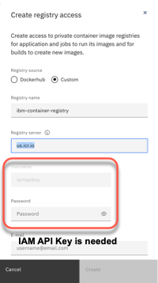
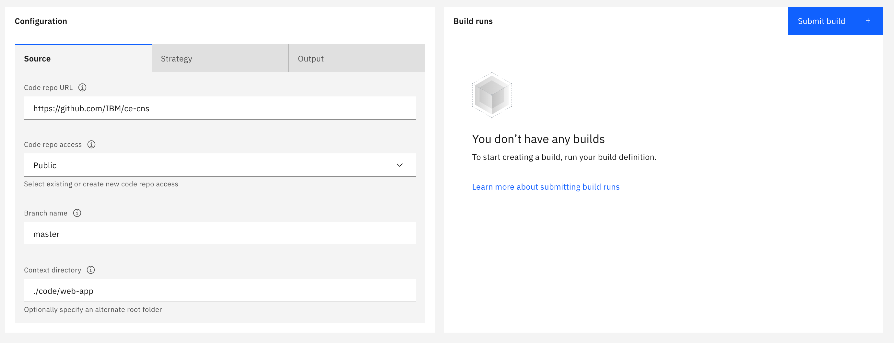

# Optional Lab 4: Use Code Engine to build a container image

Use Code Engine to build a container image for the `web-app` and save the image in the `IBM Cloud Container Registry`.

 * [IBM Cloud Container Registry](https://cloud.ibm.com/registry/catalog)

### Step 1: Create an IBM Cloud Container image `Namespace`

 1. Open following link:

    ```sh
    https://cloud.ibm.com/registry/namespaces
    ```

 2. Select **Location** `Dallas` and press `Create`

 3. Enter for **Name** `cns-code-engine` and press `Create`

    

 4. Verify the created Namespace

    

### Step 2: Start to create a `Registry access` in your Code Engine project

 1. Open `Registry access` in your Code Engine project and press `Create`

    

 2. Enter and select following values:

    *   Registry source: `Custom` 
    *   Registry name: `ibm-container-registry`
    *   Registry server: `us.icr.io`
    *   As you see, we need an `IAM API Key`. So we leave this browser tab open and we create a new browser tab.

    

 3. Open following link in the new browser tab

    ```sh
    https://cloud.ibm.com/iam/apikeys
    ```

 4. Press `Create an IBM Cloud API key`

    

 5. Insert following value and select `Create`

    * Name: `code-engine IBM Cloud API key`

    

 6. Copy `IBM Cloud API key` to clipboard

    

 7. Go back to the `Registry access` tab and insert the copied `IBM Cloud API key` and press `Create`

    

 8. Verify the newly created `Registry access`

    

### Step 3: Start to create a `Image build` in your `Code Engine project`

 1. Open `Images builds` in your Code Engine project and press `Create`

    

 2. The `Specify build details` wizard appears, which contains three steps `Sources`, `Strategy` and `Output`.
    
    

 3. Insert following values for `Sources` and press `Next`

    * Name: `web-app-image`
    * Code repo URL: `https://github.com/IBM/ce-cns`
    * Code repo access: `Public`
    * Branch name: `master`
    * Context directory: `./code/web-app`

 4. Insert or select following values for `Strategy` and press `Next`

    * Strategy: `Dockerfile`
    * Dockerfile: `Dockerfile.os4-webapp`
    * Timeout: `10m`
    * Build resources: `Small (0.5 vCPU/ 2 GB)`

    

 5. Insert or select following values for `Output` and press `Done`

    * Registry server: `us.icr.io`
    * Registry access: `ibm-container-registry`
    * Namespace: `cns-code-engine`
    * Repository (image name): `web-app-image`
    * Tag: `v1`

    

### Step 4: Now create the container image

 1. Press `Submit build`

    

 2. The `Build run` dialog appears. 
 
    Verify the `Output image` value `us.icr.io/cns-code-engine/web-app-image:v1` and press `Submit build` again.

    

 3. Open the current `Build run` 

    

 4. Open the current `Build run` and observe the progress

    

 5. Verify the created image

    