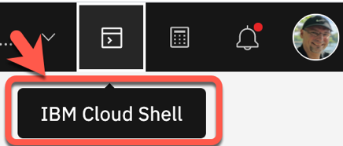
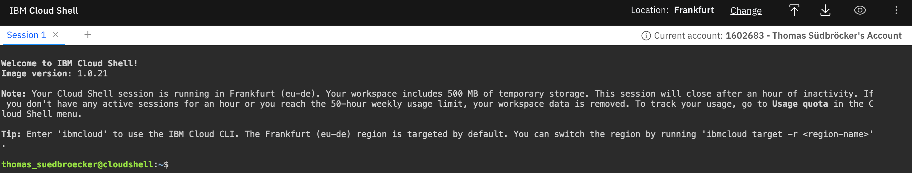

# Lab 5: Cleanup the project

We will delete all applications from your `Code Engine` project.
Remember, the Keycloak application for the `Identity and Access Management` isn't configured to `scale to zero`, because the application is `stateful` and contains the realm configuration, which will be deleted, if you restart the application.
Here we just delete all applications to avoid additional costs for you. 

> _Note:_ You can also use the UI, in that Lab we use a bash script using the [IBM Cloud Code Engine CLI](https://cloud.ibm.com/docs/codeengine?topic=codeengine-cli)

#### Step 1: Open the `IBM Cloud Shell`

Use the following link to directly open the `IBM Cloud Shell`.

<https://cloud.ibm.com/shell>

Alternatively, you can open the IBM Cloud Shell in your Browser by logging in to the [IBM Cloud](https://cloud.ibm.com) Dashboard and opening it from there.




#### Step 2: `IBM Cloud Shell`

Now you are logged on with your IBM Cloud account.



#### Step 3: (Optional) Clone the GitHub project to the `IBM Cloud Shell` 

In case your `IBM Cloud Shell` **session has expired** it might be possible that the cloned project was deleted.
If this happens, you need to clone the project again, because we will be using a bash script for the deletion of the project.

```sh
git clone https://github.com/thomassuedbroecker/ce-cns.git
cd ce-cns
ROOT_FOLDER=$(pwd)
```

#### Step 4: Now set the environment variable for later usage

> REMEMBER! Code Engine project name `cloud-native-starter-[YOUR-EXTENTION]`

```sh
cd $ROOT_FOLDER/CE
export MYPROJECT=cloud-native-starter-[YOUR-EXTENTION]
```

#### Step 5: Execute the following bash automation

Relevant to your configuration are the following variables in the bash script:

```sh
export PROJECT_NAME=$MYPROJECT #your project name
export RESOURCE_GROUP=default #the resource group you defined during the creation of the project
export REPOSITORY=tsuedbroecker #the name of the public container repository on Quay
export REGION="us-south" #the region with is used when you choose Dallas as location during the creation of the project
```

#### Step 6: Inspect the execution output

The following shows an example execution result of the bash script.

```sh
************************************
 Here are your remaing applications in your project cloud-native-starter-tsuedbro
************************************
Listing all applications...
OK
```

---

> Congratulations, you have successfully completed this hands-on workshop. Awesome you did it :star:  :star: :star: