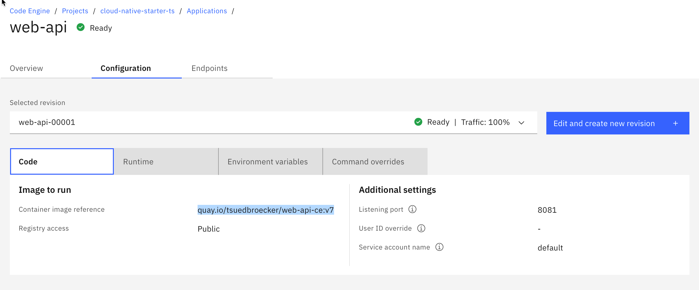

# Lab 2: Inspect the `Code Engine` project

### Step 1: Open the `Code Engine` project

Use following link to directly navigate to the Code Engine projects and open the created project.

<https://cloud.ibm.com/codeengine/projects>


### Step 2: Select `Overview`

In the following image you see:

1. The summary containing the Applications, Jobs, Image builds, Registry access, Secrets and Configmaps. In our case only the four applications are relevant.
2. The currenly usage of our application.


### Step 3: Select `Applications`

Here you find an overview of the currently running applications. (FYI The `Code Engine` definition for an application: `A program that serves HTTP requests`)


### Step 4: Open the `web-api` application

Here we see three tabs for the application. 

* Overview
* Configuration
* Endpoints

The `overview tab` shows the number of the running instances and the revisons of the configuration for those instances.


### Step 5: Inspect the configurations tab

Here we find four tabs used to configure the application instance on `Code Engine`.

* First select the `Code` tab. Here you see our container image reference to the Quay container registry.



* Then select the `Runtime` tab. It displays the configuration for the instances, vCPU, memory and requests. 

> Note: The **maximum number** of requests that can be processed concurrently per instance. This value is optional. The default value is 100.


> _Note:_ For more details about valid vCPU and Memory combinations please visit the documentation [here](https://cloud.ibm.com/docs/codeengine?topic=codeengine-mem-cpu-combo) .

* Now select the `Environment variables` tab. 

Here you see the routes for the `wep-api` microservice to setup the connections **internal** `articels` microservice and the external `Keycloak` application.


* In the  `Command overrides` tab. 


A short extract of the Code Engine documentation:

> _"These metadata fields are called Entrypoint and Command. For those users who are familiar with Dockerfile, the fields equate to the **ENTRYPOINT and CMD commands**. These two fields contain arrays of strings that are combined to create the command line that is used when you run your container."_

For details  visit the [IBM Cloud documentation](https://cloud.ibm.com/docs/codeengine?topic=codeengine-cmd-args).

### Step 6: Endpoints tab

Here you can change the `endpoint` visibility. For our `web-api` application we need a public visibility because the application is invoked by our `web-app` frontend.


### Step 7: Verify the `Code Engine CLI` application instance configuration

In following code you see the `Code Engine CLI` invocation for the `web-api` microservice, this code is used in the bash script to create a Code Engine application instance. It reflects what you have seen in the [`Code Engine UI`](https://cloud.ibm.com/codeengine/projects).

> Note: The only difference is the threshold of concurrent requests per instance at which one or more additional instances are created is defined. Use this value to scale up instances based on concurrent number of requests. If `--concurrency-target` is not specified, this option defaults to the value of the `--concurrency` option. This value is optional. The default value is `0`.

 

```sh
# Valid vCPU and memory combinations: https://cloud.ibm.com/docs/codeengine?topic=codeengine-mem-cpu-combo
    ibmcloud ce application create --name web-api \
                                --image "quay.io/$REPOSITORY/web-api-ce:v7" \
                                --cpu "0.5" \
                                --memory "1G" \
                                --env QUARKUS_OIDC_AUTH_SERVER_URL="$KEYCLOAK_URL/auth/realms/quarkus" \
                                --env CNS_ARTICLES_URL="http://articles.$NAMESPACE.svc.cluster.local/articles" \
                                --max-scale 1 \
                                --min-scale 0 \
                        --concurrency-target 100 \
                                --port 8081
```

### Step 8: Estimate cost

You can easily estimate cost for your Code Engine application. 
Just select `estimate cost` and configure your region, cpu and storage,  estimated monthly runtime for your application and the number of application instances. For more details visit the [IBM Cloud documentation](https://cloud.ibm.com/codeengine/overview).


---

> Congratulations, you have successfully completed this hands-on lab ` Inspect the Code Engine project` of the workshop. Awesome :star:

