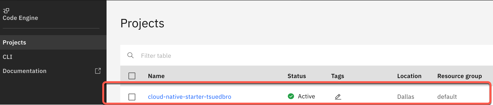

# Lab 2: Inspect the `Code Engine` project

### Step 1: Open the `Code Engine` project

Use following link to directly navigate to the Code Engine projects and open the created project.

<https://cloud.ibm.com/codeengine/projects>



### Step 2: Select `Overview`

In the following image you see:

1. The summary containing the Applications, Jobs, Image builds, Registry access, Secrets and Configmaps. In our case only the four applications are relevant.
2. The currenly usage of our application.


### Step 3: Select `Applications`

Here you find an overview of the currently running applications. (FYI The `Code Engine` definition for an application: `A program that serves HTTP requests`)


### Step 4: Open the `web-api` application

Here we find the configurations for the application. 

* First select the `Code` tab. Here you see our container image reference to the Quay container registry.


* Then select the `Runtime` tab. The configuration for the instances, vCPU, memory and requests.


> _Note:_ For more details about valid vCPU and Memory combinations please visit the documentation [here](https://cloud.ibm.com/docs/codeengine?topic=codeengine-mem-cpu-combo) .

* Now select to `Environment variables` tab. 

Here you see the routes for the `wep-api` microservice to setup the connections **internal** `articels` microservice and the external `Keycloak` application.


_Note:_ In following code you see the `Code Engine CLI` invocation for the `web-api` microservice, that is used in the bash script. It reflects what you see in the Code Engine UI.

```sh
# Valid vCPU and memory combinations: https://cloud.ibm.com/docs/codeengine?topic=codeengine-mem-cpu-combo
    ibmcloud ce application create --name web-api \
                                --image "quay.io/$REPOSITORY/web-api-ce:v7" \
                                --cpu "0.5" \
                                --memory "1G" \
                                --env QUARKUS_OIDC_AUTH_SERVER_URL="$KEYCLOAK_URL/auth/realms/quarkus" \
                                --env CNS_ARTICLES_URL="http://articles.$NAMESPACE.svc.cluster.local/articles" \
                                --max-scale 1 \
                                --min-scale 0 \
                                --port 8081
```

---

> Congratulations, you have successfully completed this hands-on lab ` Inspect the Code Engine project` of the workshop. Awesome :star:

