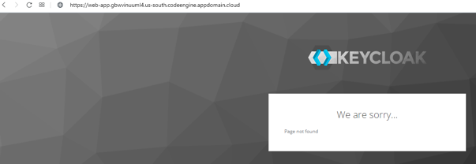
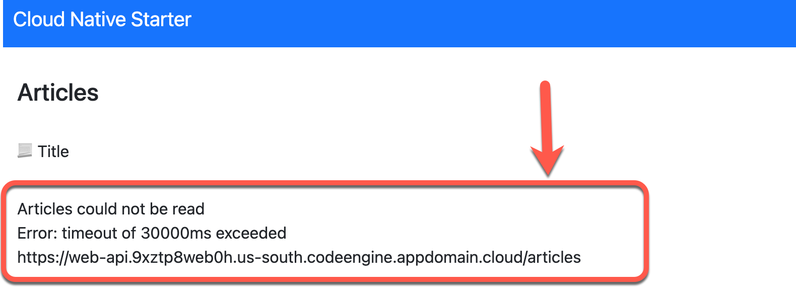
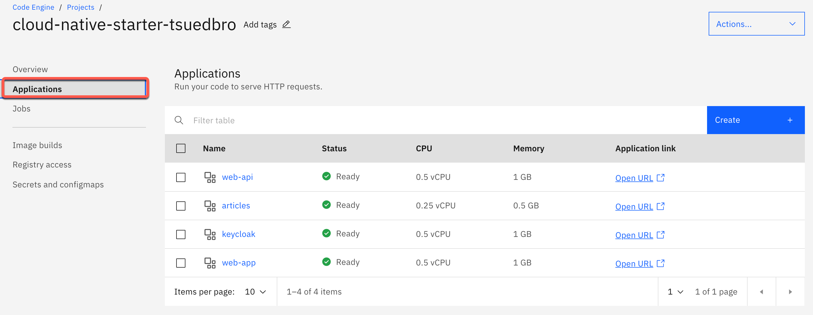
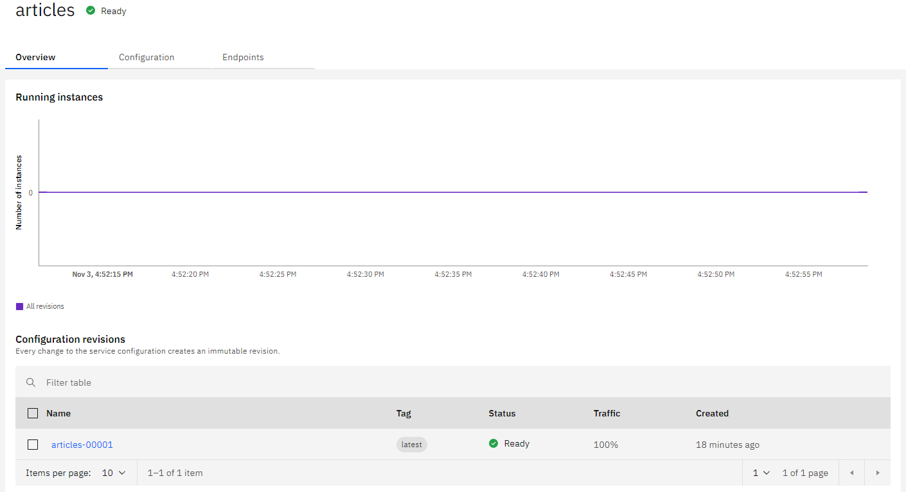
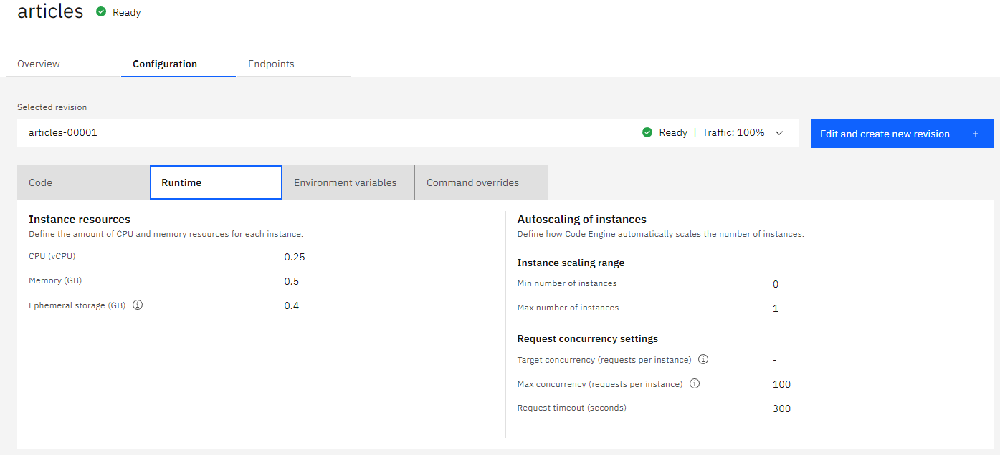
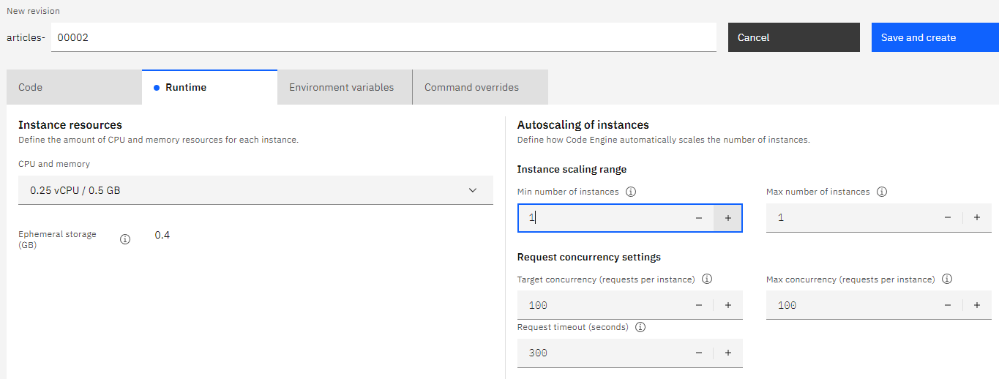
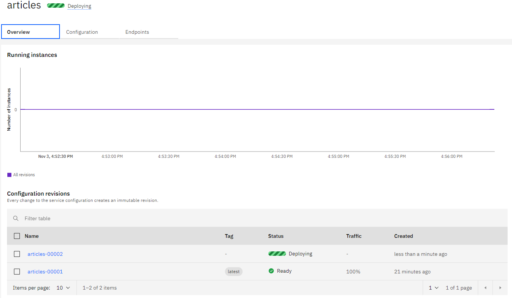
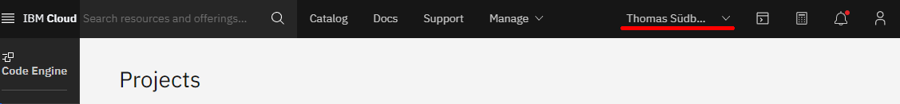
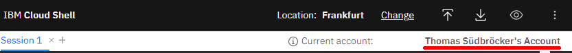

# Known issues
### 1. Error message from Keycloak  appears, when you invoke the `web-app`

When you get the following error message from Keycloak, after you invoked the `web-app` url, something went wrong during the Keycloak configuration at the setup. One reason could be, that the `Keycloak` container was restarted after the `Keycloak` configuration and the container lost the needed `realm` configuration for the example application.
 


Keycloak needs to be reconfigured.

* Ensure you set project name

```sh
export MYPROJECT=cloud-native-starter-[YOUR-EXTENTION]
```

* Execute the [`ce-reconfigure-keycloak.sh`](https://github.com/ibm/ce-cns/blob/master/CE/ce-reconfigure-keycloak.sh) bash script

```sh
cd $ROOT_FOLDER/CE
bash ce-reconfigure-keycloak.sh
```
### 2. Timeout message appears, after loggin in 

If the following error message persists after refreshing your Browser multiple times, we will ensure that the `articles` service will run continously with one instance.



To fix the issue, we will change the configuration of the `articles` service.

#### Step 1: Open the following link to access your projects and from there click on the project you created.

https://cloud.ibm.com/codeengine/projects
 
> Note: Your project should be named `cloud-native-starter-[YOUR-EXTENTION]`

#### Step 2: Click on your project and select `Applications`.



#### Step 3: Open the `articles` application



#### Step 4: Open the `Configuration` tab, and select `Runtime`.



#### Step 5: Click on `Edit and create new revision`

Now you change the `Min number of instances` from 0 to 1. This ensures, that the `articles` service is permanently available for the `web-api` service.



#### Step 6: Press the `Save and create` Button

This creates a new configuration for the `articles` application as you can see in the `Overview` tab under `Configuration revisions`.



### Issues with multiple Accounts

If you have multiple `IBM Cloud` accounts, please verify that the account logged in to the `Code Engine` dashboard matches the account logged in to the `IBM Cloud Shell`.


#### Step 1: Verify account logged in to the `Code Engine` dashboard


#### Step 2: Verify account logged in to the `IBM Cloud Shell`


