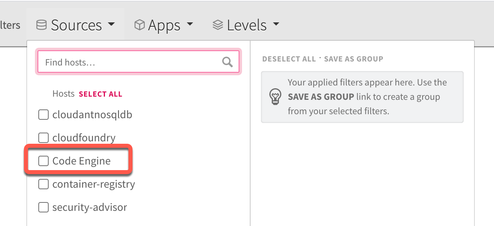

# Lab 4: Logging of the applications

Here we use the [IBM Cloud Log Analysis](https://cloud.ibm.com/docs/log-analysis?topic=log-analysis-getting-started#getting-started) (lite plan).

### Create the logging service automatically

You can create the lite service instances for logging and monitoring by using this bash script [`ce-create-monitoring-logging-services.sh`](https://github.com/IBM/ce-cns/blob/master/CE/ce-create-monitoring-logging-services.sh)

```sh
cd $ROOT_FOLDER/CE
bash ce-create-monitoring-logging-services.sh
```

### Open the logging for all applications

#### Step 1: Go back to the project overview


#### Step 2: Select `Actions -> Logging`


> In case you don't have an existing instance of `IBM Cloud Log Analysis` Code Engine follow steps in `Create an IBM Cloud Log Analysis service manually` or use the `bash script`.

#### Step 3: Verify the IBM Cloud Log Analysis will be opened in the browser 


### Create an IBM Cloud Log Analysis service **manually**

#### Step 1: Select `Actions -> Add logging`

In case you don't have an existing instance of `IBM Cloud Log Analysis`, Code Engine will automatically guide you to create a `lite plan` instance, when you select `Actions -> Add logging`.


#### Step 2: In the upcoming dialog select `Lite` and leave the defaults selected for `region` and `resource group`.

Name the service instance `IBMCloudLogging-Code-Engine` and press `Create`.


#### Step 3: Refresh your browser with your Code Engine project.
 
When the `IBM Cloud Log Analysis` is ready and you select `Actions -> Add logging` again, the following dialog will appear.
In this dialog you select your just created `IBM Cloud Log Analysis` service instance with the name `IBMCloudLogging-Code-Engine`.


Now you use the `IBM Cloud Log Analysis` service.

### Configure a filter for the logging

#### Step 1: Select `Code Engine` in the sources tab



#### Step 2: Insert `"-->log:"` as a text filter

```sh
"-->log:"
```


#### Step 3: Invoke the frontend application several times

In the gif you see an example result. Now you filter the custom console outputs of the microservices `web-api` and `articles`.
If you want to can save it as a view in the `Log Analysis UI`.


For more details please use the [IBM Cloud Code Engine documentation for logging](https://cloud.ibm.com/docs/codeengine?topic=codeengine-view-logs)

---

> Congratulations, you have successfully completed this hands-on lab `Logging of the applications` of the workshop. Awesome :star: