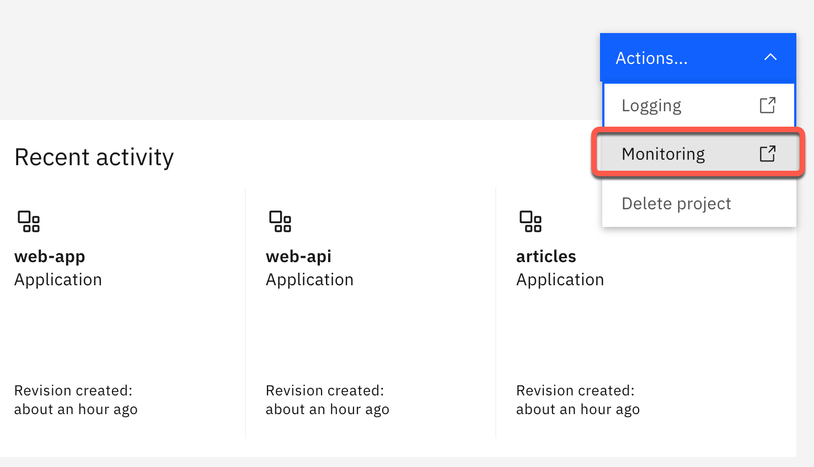
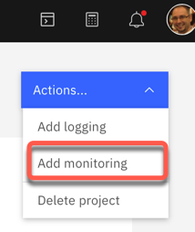
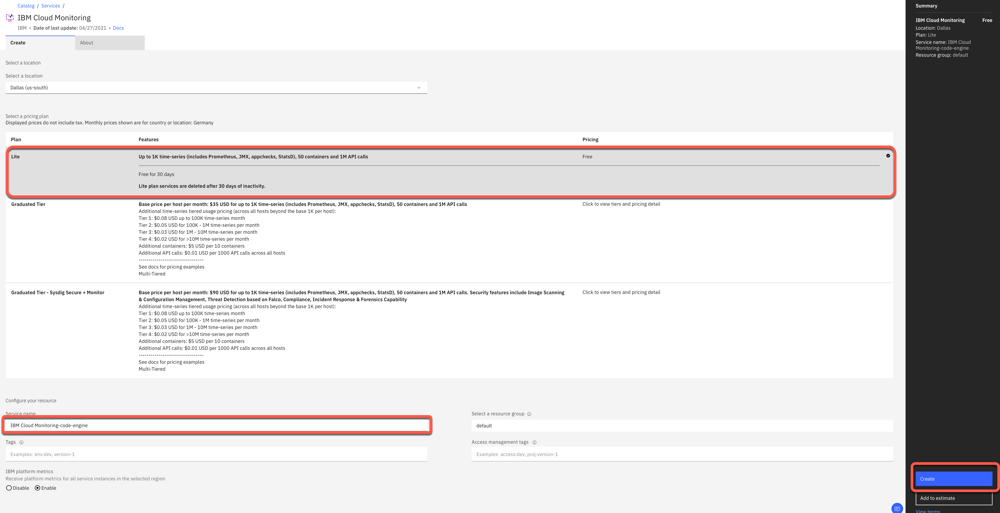
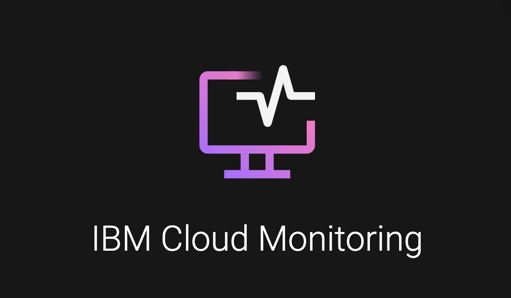

# Lab 3: Application Monitoring

Here we use the [IBM Cloud Monitoring](https://cloud.ibm.com/docs/monitoring?topic=monitoring-getting-started#getting-started) (lite plan) service.

### Create the monitoring service automatically

You can create the lite service instances for `logging` and `monitoring` by using this bash script [`ce-create-monitoring-logging-services.sh`](https://github.com/IBM/ce-cns/blob/master/CE/ce-create-monitoring-logging-services.sh).

```sh
cd $ROOT_FOLDER/CE
bash ce-create-monitoring-logging-services.sh
```

### Open the monitoring for all applications

#### Step 1: Go back to the project overview


#### Step 2: Select `Actions -> Monitoring`



#### Step 3: Verify that IBM Cloud Monitoring opens in the browser

### Create an IBM Cloud Monitoring service manually

#### Step 1: Select `Add monitoring`

In case you don't have an existing instance of `IBM Cloud Monitoring` Code Engine will automatically guide you to create a `lite plan` instance, when you select `Add monitoring`.



#### Step 2: In the upcoming dialog select `Lite` and leave the defaults selected for `region` and `resource group`

Name the service instance `IBMCloudMonitoring-Code-Engine` and press `Create`.



#### Step 3: Refresh your browser with your Code Engine project.

Now you will notice that you can select `Actions -> Monitoring`.



### Inspect the monitoring posibilities

### Step 1: Expore the given monitoring posibilities

For more details please use the [IBM Cloud Code Engine documentation for monitoring](https://cloud.ibm.com/docs/codeengine?topic=codeengine-monitor).


---

> Congratulations, you have successfully completed this hands-on lab `Application Monitoring` of the workshop. Awesome :star: