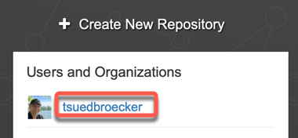
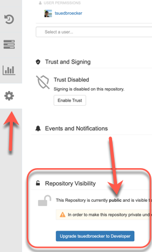

# Optional Lab 2: Push the example container images to a container image registry

In this optional lab we will push your example container images to a container image registry.
We use the free [Red Hat Quay.io](https://quay.io) as our example container registry. Quay has a Community Distribution that powers [Red Hat Quay](https://www.redhat.com/en/resources/quay-datasheet) and [Quay.io](https://quay.io) called [Project QUAY](https://www.projectquay.io) You need to create a free account.

> You can also use the [IBM Cloud Registry](https://cloud.ibm.com/registry/catalog) which has a free lite plan with limited resources of Storage (Gigabyte-Months):
>
> * 0.5 GB free per month and pull traffic (Gigabytes) 
> * 5 GB free per month. Please visit the [IBM Cloud Registry catalog for the current pricing](https://cloud.ibm.com/registry/catalog).

To run these optional exercises, you need to ensure you have installed the following tools on your local machine and you can run them in your terminal sessions.

* [git 2.24.1 or higher](https://git-scm.com/book/en/v2/Getting-Started-Installing-Git)
* [Docker 3.0.4 or higher](https://www.docker.com/products/docker-desktop)
* [Podman Client / Server	4.1.0 / 4.3.0 or higher](https://www.docker.com/products/docker-desktop)

### Step 1: Login to Quay on your local machine

```sh
[docker OR podman] login [quay.io OR docker.io]
```

### Step 2: Ensure `$ROOT_PATH` variable is set to `YOUR_PATH/ce-cns` of your cloned repository

Display the `$ROOT_PATH` you set in `Lab 1: Setup the example application`.

```sh
echo $ROOT_PATH
```

You can use for example:

```sh
cd YOUR_PATH/ce-cns
export ROOT_PATH=$(pwd)
```

### Step 3: Configure articles 

When you run the articles microservice on CE ensure you have uncommented `quarkus.http.port=8080` and `#quarkus.http.port=8083` commented out.

```sh
cd $ROOT_PATH/code/articles/src/main/resources
nano application.properties
```

Example:

```Java
# When running locally, uncomment the next line, add your Keycloak URL, must end on '/auth/realms/quarkus'
quarkus.oidc.auth-server-url=http://localhost:8282/auth/realms/quarkus

quarkus.oidc.client-id=backend-service
quarkus.oidc.credentials.secret=secret

quarkus.http.port=8080
# When running locally, uncomment the next line, to use the port 8083
# quarkus.http.port=8083
quarkus.http.cors=true

resteasy.role.based.security=true
```

### Step 4: Export your container registry name as your repository name

```sh
export MY_REGISTRY=[quay.io OR docker.io]
```

### Step 5: Export your Quay username as your repository name

```sh
export MY_REPOSITORY=YOUR_USERNAME
```

_Note:_ In the image below you see an example where you can find the name, you should use.



### Step 6: Execute the following bash automation

This bash script will build and push your container images to [Red Hat Quay.io](https://quay.io).

Invoke the script with the parameter `podman` or `docker`.

```sh
cd $ROOT_PATH/CE
bash container-image-build-and-push.sh podman
```

* Example output:

```sh
************************************
 Display parameter
************************************

Parameter count : podman
Parameter zero 'name of the script': container-image-build-and-push.sh
---------------------------------
Local container engine   : podman
Root path                : /Users/thomassuedbroecker/Downloads/dev/ce-workshop-ibm/ce-cns
Container repository     : tsuedbroecker
Container registry       : quay.io
-----------------------------
*** Setup container engine to Podman!
************************************
```

### Step 7: Verify the public access for your containers

Visit your repository on [Red Hat Quay.io](https://quay.io) and verify your containers are available for public usage. This is only the case if you are going to run the same setup as given in `Lab 1: Setup the example application`.



### Step 8: Update the `ce-deploy-apps.sh` bash script

Now you have to reflect the changes you made for the container registry in the `ce-deploy-apps.sh`, if you plan to use this bash script to deploy your containers to `Code Engine`.

1. Open the bash script with an editor

```sh
cd $ROOT_PATH/ce
nano ce-deploy-apps.sh
``` 

2. In case you have just changed the repository name, you only have to replace `tsuedbroecker` with your value and it should work.

```sh
...
export PROJECT_NAME=$MYPROJECT
export RESOURCE_GROUP=default
export REPOSITORY=tsuedbroecker
...
```

---

> Congratulations, you have successfully completed this optional hands-on lab tasks for `Push the example containers to a container registry` section of the workshop. Awesome :star: