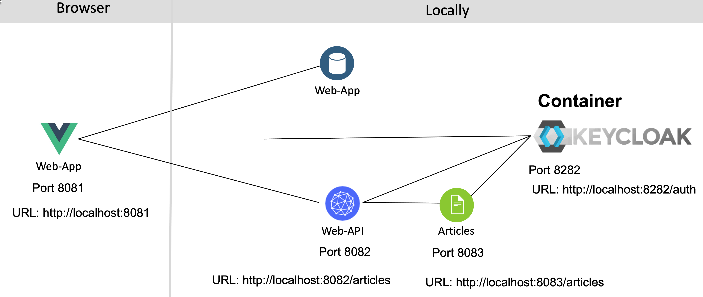
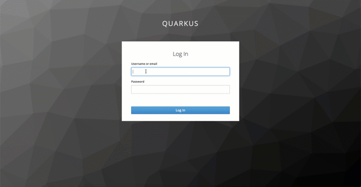
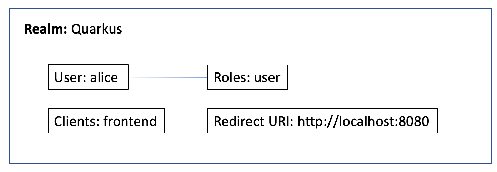
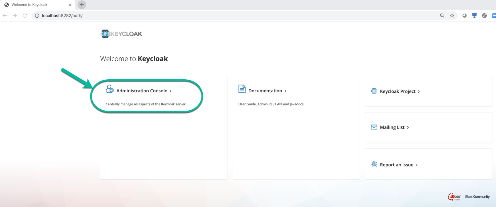
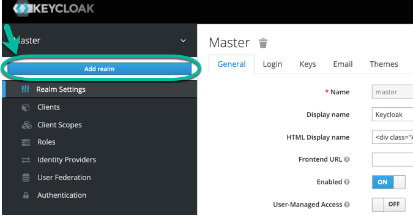
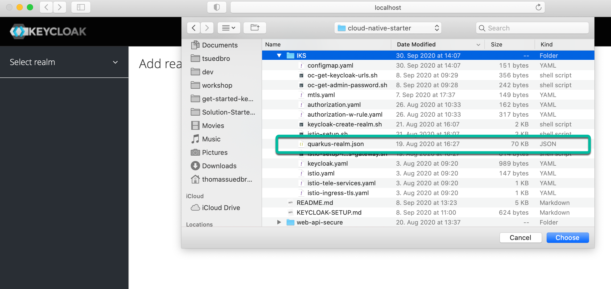
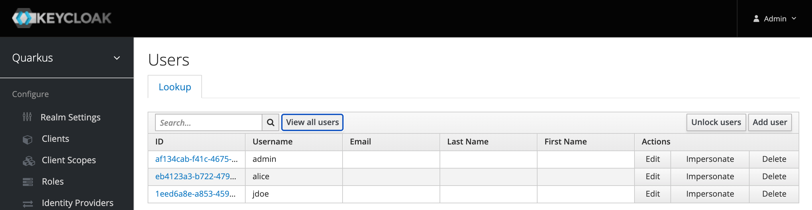
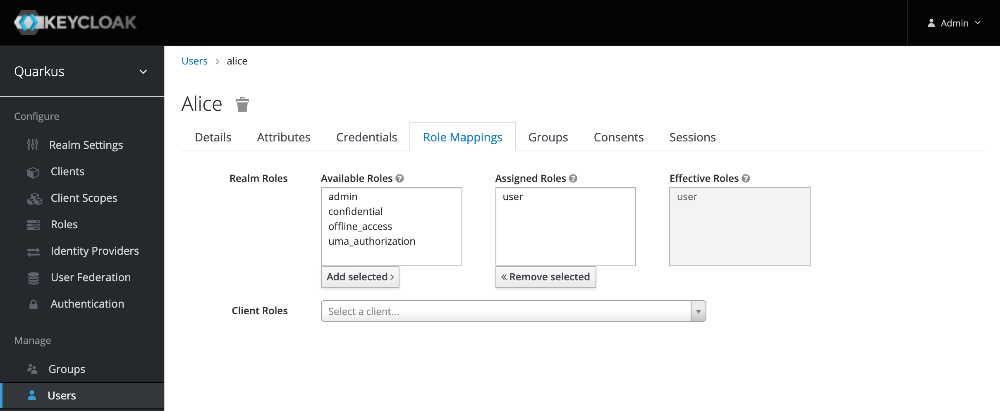

# Optional Lab 1: Run the example application locally

To run these optional exercises you need to ensure you have installed the following tools on your local machine and you can run them in your terminal sessions.

* [git 2.24.1 or higher](https://git-scm.com/book/en/v2/Getting-Started-Installing-Git)
* [yarn 1.22.4 or higher](https://yarnpkg.com)
* [Node.js v14.6.0 or higher](https://nodejs.org/en/)
* [Apache Maven 3.6.3](https://maven.apache.org/ref/3.6.3/maven-embedder/cli.html)
* [Docker 3.0.4 or higher](https://www.docker.com/products/docker-desktop) (running Keycloak locally)
* Java 9 or higher

### Architecture

Here is the local architecture whichs shows the **Web-App** and the two microservices **Web-API** and **Articles** and **Keycloak** are running on your local machine in terminal sessions.



The gif shows the logon to the example web frontend application. This is the simplified sequence which happens in the background:

1. When we invoke the web frontend on `<http://localhost:8081> we will be routed to login dialog provided by the Keyloak server.
2. After the successfull Keycloak authentication we will be redirected to the web frontend and the frontend gets an access-token.
3. The access-token contains the needed information for the authorization at the Java microservice Web-API and the user information.
4. The web frontend extracts and displays the username.
5. Then the web fronted uses the access-token to invoke the Web-API Microservice endpoint to get the articles and displays them.



### Step 1: Clone the project to your local machine

```sh
git clone https://github.com/thomassuedbroecker/ce-cns.git
cd ce-cns
ROOT_FOLDER=$(pwd)
```

### **Setup Keycloak locally**

In this part we will setup Keycloak locally. We will run a local Keycloak Docker container and reuse an existing realm configuration.

The image below shows the relevant elements we will use later.



---

#### Step 1: Start Keycloak Docker image local

Open the first terminal session and enter following command:

```sh
docker run -it -e KEYCLOAK_USER=admin -e KEYCLOAK_PASSWORD=admin -p 8282:8080 jboss/keycloak:9.0.2
```

_Note:_ We use here

  * `KEYCLOAK_USER=admin`
  * `KEYCLOAK_PASSWORD=admin`
  * `8282:8080` port forwarding
  * `keycloak:9.0.2` container image

#### Step 2: Import the existing realm configuration

1. Open the Keycloak in a browser and select the Administration Console

  Use following URL:

  ```sh
  http://localhost:8282/
  ```

  

1. Login to using the URL in your browser with `user/admin` and `password/admin`

1. Select _Add realm_

  

1. Choose for import _Select file_ and open the `cns-realm.json`.

  

#### Step 3: Press `view all users`

You should see following users: `admin`, `alice`, `jdoe`



#### Step 4: Verify the role mapping



### **Setup Web-App**

#### Step 1: Configure web-app

The web-app is preconfigured for local usage of Keycloak (`http://localhost:8282/auth`) and web-api (`http://localhost:8082/articles`) and save the changes. (Link to [main.js](https://github.com/IBM/ce-cns/blob/master/code/web-app/src/main.js) file)

```sh
cd $ROOT_FOLDER/code/web-app/src
nano main.js
```

Example:

```JavaScript
if (currentHostname.indexOf('localhost') > -1) {
  console.log("--> log: option 1");
  urls = {
    api: 'http://localhost:8082',
    login: 'http://localhost:8282/auth',
    cns: 'http://localhost:8081'
  }
  store.commit("setAPIAndLogin", urls);
}
```

#### Step 2: Run the web-app

Open the second terminal session and start the application on port 8081.

```sh
cd $ROOT_FOLDER/code/web-app
yarn install
yarn serve
```

### **Setup Web-Api**

#### Step 1: Configure web-api

When we run the example application locally, we don't need to change the source code for the **web-api** microservce. (Link to [application.properties](https://github.com/IBM/ce-cns/blob/master/code/web-api/src/main/resources/application.properties) file)

```sh
cd $ROOT_FOLDER/code/web-api/src/main/resources
nano application.properties
```

Example:

```Java
# When running locally, uncomment the next line, add your Keycloak URL, must end on '/auth/realms/quarkus'
quarkus.oidc.auth-server-url=${QUARKUS_OIDC_AUTH_SERVER_URL:'http://localhost:8282/auth/realms/quarkus'}

quarkus.oidc.client-id=backend-service
quarkus.oidc.credentials.secret=secret

quarkus.http.port=8082
quarkus.http.cors=true

org.eclipse.microprofile.rest.client.propagateHeaders=Authorization

cns.articles-url=${CNS_ARTICLES_URL:'http://localhost:8083/articles'}
```

#### Step 2: Run the web-api Microservice

Open a third terminal and start the service on port 8082.

```sh
cd $ROOT_FOLDER/code/web-api
mvn clean package quarkus:dev
```

### **Setup Articles microservice**

#### Step 1: Configure articles 

When you run the articles microservice locally ensure you have uncommented `quarkus.http.port=8083` and `#quarkus.http.port=8080` commented out. ((Link to [application.properties](https://github.com/IBM/ce-cns/blob/master/code/articles/src/main/resources/application.properties) file)

```sh
cd $ROOT_FOLDER/code/articles/src/main/resources
nano application.properties
```

Example:

```Java
# When running locally, uncomment the next line, add your Keycloak URL, must end on '/auth/realms/quarkus'
quarkus.oidc.auth-server-url=http://localhost:8282/auth/realms/quarkus

quarkus.oidc.client-id=backend-service
quarkus.oidc.credentials.secret=secret

# quarkus.http.port=8080
# When running locally, uncomment the next line, to use the port 8083
quarkus.http.port=8083
quarkus.http.cors=true

resteasy.role.based.security=true
```

#### Step 2: Run the articles Microservice

Open a fourth terminal and start the service on port 8083.

```sh
cd $ROOT_FOLDER/code/articles
mvn clean package quarkus:dev
```

### Open the Web-App

#### Step 1: Open the Web-App in your local browser

Open the following URL in your browser:

```sh
http://localhost:8081
```

#### Step 2: Log in with the test user: alice, password: alice

---

> Congratulations, you have successfully completed this optional hands-on lab tasks for `Authentication and Authorization with Keycloak and Quarkus` section of the workshop. Awesome :star:
