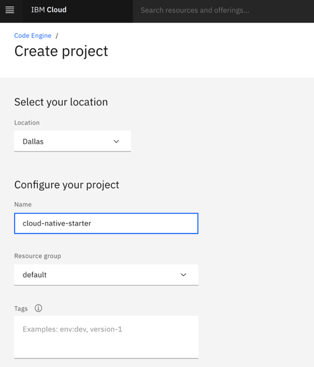

# Lab 1: Setup the example application

### IBM Cloud Account

#### Step 1: Create a `PayAsYouGo` IBM Cloud Account

Open this [link](https://ibm.biz/BdfXAn) and follow the guided steps.

`Code Engine` has a `free tier` per month and we expect, if you haven't used that `free tier` in current month, you can execute the workshop without creating any additional costs. For the monitoring and logging we will use free `lite plans` for the service instances of [IBM Cloud Monitoring](https://cloud.ibm.com/docs/monitoring?topic=monitoring-getting-started#getting-started) and 
 [IBM Cloud Log Analysis](https://cloud.ibm.com/docs/log-analysis?topic=log-analysis-getting-started#getting-started).

Here you find the actual [`Code Engine` pricing](https://www.ibm.com/cloud/code-engine/pricing).
The image blow shows a screen shot from `26. May 2021` of the `free tier`.


### Create `Code Engine` project

#### Step 1: Logon to IBM Cloud and navigate to the Code Engine projects

Use following link to directly navigate to the Code Engine projects in IBM Cloud.

<https://cloud.ibm.com/codeengine/projects>

#### Step 2: Navigate to Code Engine projects in IBM Cloud and press `Create`


#### Step 3: Create a `Code Engine` project called `cloud-native-starter-[YOUR-EXTENTION]`

Enter following values and select create and wait until your project is created.

* Location      : `Dallas`
* Name          : `cloud-native-starter-[YOUR-EXTENTION]` (The name must be unique in the in Cloud Location `Dallas`)
* Resource group: `default`



The image below shows the created `Code Engine` project.


### `IBM Cloud Shell`

#### Step 1: Open the `IBM Cloud Shell`

When using the IBM Cloud Shell, no client-side setup is required for this workshop, it comes with all necessary CLIs (command line tools).

Use following link to directly open the `IBM Cloud Shell`.

<https://cloud.ibm.com/shell>

In your browser, login to the [IBM Cloud](https://cloud.ibm.com) Dashboard and open the IBM Cloud Shell from here:


_Note:_ Your workspace includes 500 MB of temporary storage. This session will close after an hour of inactivity. If you don't have any active sessions for an hour or you reach the 50-hour weekly usage limit, your workspace data is removed.

#### Step 2: `IBM Cloud Shell`

Now you are logged on with your IBM Cloud account.


### Deploy the example application

#### Step 1: Clone the GitHub project to the `IBM Cloud Shell`

Insert these commands to clone the GitHub project to the `IBM Cloud Shell`.

```sh
git clone https://github.com/ibm/ce-cns.git
cd ce-cns
ROOT_FOLDER=$(pwd)
```

#### Step 2: Now set the environment variable for later usage

> REMEMBER! Your Code Engine project name `cloud-native-starter-[YOUR-EXTENTION]`

```sh
export MYPROJECT=cloud-native-starter-[YOUR-EXTENTION]
```

#### Step 3: Execute following bash automation

> Be patient, because the script may take several minutes (_up to 10 min_).

```sh
cd $ROOT_FOLDER/CE
bash ce-deploy-apps.sh
```

> Note: Here are the `default values` for the  [`ce-deploy-apps.sh`](https://github.com/IBM/ce-cns/blob/master/CE/ce-deploy-apps.sh) script:

```sh
export PROJECT_NAME=$MYPROJECT #your project name
export RESOURCE_GROUP=default #the resource group in IBM Cloud you defined during the creation of the project
export REPOSITORY=tsuedbroecker #the name of the public container repository on Quay
export REGION="us-south" #the region in IBM Cloud that is used. When you choose Dallas as location during the creation of the project the region is "us-south"
```

If you plan to use a different configuration, you need ajust these variables to your needs. For more details please visit the bash script: [`ce-deploy-apps.sh`](https://github.com/IBM/ce-cns/blob/master/CE/ce-deploy-apps.sh). The bash script uses for example the `ibmcloud target -g` command to target `IBM Cloud Resouce Group`.

```sh
ibmcloud target -g $RESOURCE_GROUP
```

#### Step 4: Simplified steps of the bash script

Here are the simplified steps that are carried out in the bash script using mainly the IBM Cloud `Code Engine CLI`:

1. Connect to the `Code Engine project` with the  [Code Engine CLI](https://cloud.ibm.com/docs/codeengine?topic=codeengine-cli) and get the **namespace** for later usage to define the internal route.
2. Deploy `web-app` to get needed route for the redirect of Keycloak 
3. Deploy `Keycloak` simply as a container (that's the reason why not scale to zero (stateful)) 
4. Configure the `Keycloak` realm json file based on the `web-app` url and create realm.
5. Deploy `articles` microservice is defined as `local cluster` here, we need to know the `namespace`. ([details are related to Knative](https://github.com/knative/serving/issues/7450))
6. Deploy `web-api` with the needed `Keycloak` and articles urls as environment variables.
7. Reconfigure `web-app` with the needed `Keycloak` and web-api urls as environment variables.

> PS: You can also use the [`ce-deploy-apps-secret.sh`](https://github.com/IBM/ce-cns/blob/master/CE/ce-deploy-apps-secret.sh) script, which does create [secrets](https://cloud.ibm.com/docs/codeengine?topic=codeengine-configmap-secret) for the user and password for the Keycloak container.

```sh
cd $ROOT_FOLDER/CE
bash ce-deploy-apps-secret.sh
```

#### Step 5: Inspect the execution output

The following shows an example execution result of the bash script and the last four lines do contain the routes to the applications.

```sh
************************************
 URLs
************************************
 - Keycloak : https://keycloak.9xztp8web0h.us-south.codeengine.appdomain.cloud/auth/admin/master/console/#/realms/quarkus
 - Web-API  : https://web-api.9xztp8web0h.us-south.codeengine.appdomain.cloud
 - Articles : http://articles.9xztp8web0h.svc.cluster.local/articles
 - Web-App  : https://web-app.9xztp8web0h.us-south.codeengine.appdomain.cloud
```

You can open the example application with the `Web-App` link. Copy the link and open the link in a browser.

#### Step 6: Open the example application in your browser

Use `user: alice` and `password: alice` for the logon.


> Because of scale to zero it could be that the first invocation of the articles cloud take longer. 
 

 
Just refresh the browser and then you should see following page.

 

---

> Congratulations, you have successfully completed this hands-on lab `Setup the example application` of the workshop. Awesome :star:
