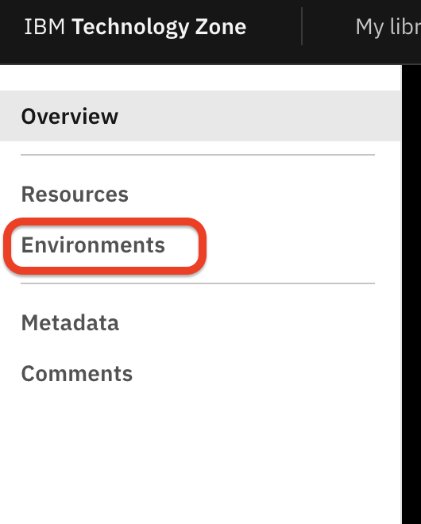
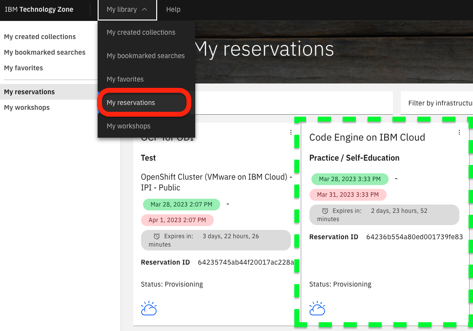

# Reserve a Techzone environment

### Step 1: Open the [Techzone asset](https://techzone.ibm.com/collection/an-example-to-deploy-a-existing-java-microservices-based-application-to-codeengine)

### Step 2: Select the environments section of the asset

### Step 3: Create a reservation

In `Create a reservation` example you can chose `Reserve now` as type for your reservation

### Step 4: Fill out the reservation form and press `Submit`

### Step 5: Verify your reservation confirmation

### Step 6: Verify the status of your reservation

### Step 7: Verify the email you got from Techzone

In the mail you will find the relevant information for the IBM Cloud environment you got for that workshop.

### Step 8: Ensure you are in the IBM Cloud account

> Note: If this doesn't work, please verify the content of your mail again.

